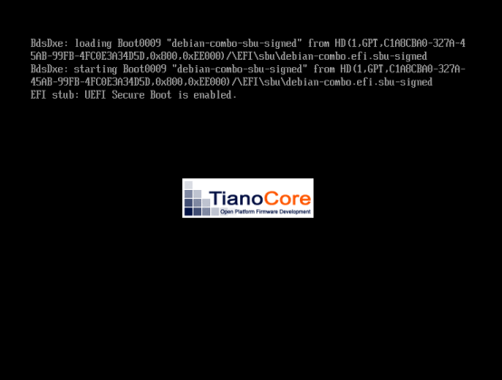

# The Secure Boot Utils

Utilities for working with EFI Secure Boot.

* [The Utilities](#the-utilities)
* [Building the Utilities](#building-the-utilities)
* [QEMU Experiments](#qemu-experiments)
* [License & Usage](#license--usage)

# The Utilities

## sbu-generate-user-keys

**sbu-generate-user-keys** will generate a collection of user signing keys that
can be used to manage a secure boot system.

Keys Generated:

* PK = Platform Key
* KEK = Key Exchange Key
* MOK = Machine Owner Key
* DB = Whitelist Database Key (for signing OS images)

The output directory contains an `efi-keystore` sub-directory that holds X.509
certificate files for use when enrolling the generated keys in the system's EFI
firmware.  Certificates can be enrolled with the EFI firmware setup program, or
with utilities like `sbkeysync`, `mokutil`, and `efi-updatevar`.  These
different methods want the certificate file to be of a certain format, so each
key certificate in `efi-keystore` is provided in four different file formats:

* `.der`  = DER  = X.509 Distinguished Encoding Rules.
* `.pem`  = PEM  = X.509 Privacy Enhanced Mail (Base64 encoded DER).
* `.esl`  = ESL  = EFI signature list.
* `.auth` = AUTH = Signed EFI signature list.

Note that the output directory's `keys` sub-directory containes the private
keys used for generating signatures.  The files `*_keys.pem` in this directory
must be kept secret.

For more info on using user generated secure boot keys, the types of keys
secure boot uses, certificate file formats, etc., see the
[National Security Agency's UEFI Secure Boot Customization](https://media.defense.gov/2020/Sep/15/2002497594/-1/-1/0/CTR-UEFI-Secure-Boot-Customization-UOO168873-20.PDF)
and the
[National Security Agency's UEFI LOCKDOWN GUIDE](https://www.nsa.gov/Portals/70/documents/what-we-do/cybersecurity/professional-resources/csi-uefi-lockdown.pdf)
(highly recommended readings).

### Usage

```
sbu-generate-user-keys.sh - Generate user keys for EFI secure boot.
Usage: sbu-generate-user-keys.sh [flags]
Option flags:
  -f --force        - Overwrite existing keys.
  -o --out-dir      - Output directory. Default: '/tmp/sbu-generate-user-keys'.
  -s --cert-subject - Certificate subject. Default: '/O=Secure Boot Utils/OU=Boot Keys'.
  -l --key-length   - Key length. Default: '2048'.
  -h --help         - Show this help and exit.
  -v --verbose      - Verbose execution.
  -g --debug        - Extra verbose execution.
Common X.509 Subject Attributes:
  CN = Common Name
  O  = Organization
  OU = Organizational Unit
  L  = Locality
  S  = State or Province Name
  C  = Country Name
Info:
  sbu-generate-user-keys.sh (Secure Boot Utils) version
  https://github.com/glevand/secure-boot-utils
  Send bug reports to: Geoff Levand <geoff@infradead.org>.
```

## sbu-make-combo-loader

**sbu-make-combo-loader** uses a provided systemd EFI bootloader stub to create
an EFI bootloader program that includes a Linux kernel, an initrd, and Linux
kernel command line.  The resulting EFI program image is often called a 'Unified Kernel
Image'. This image can be used as is for a non-secure boot, or can be signed
and used for secure boot.  EFI firmware can load and run the signed or unsigned
image from local storage or via PXE network boot.

Most current Linux distributions will include a pre-built systemd bootloader
stub.  The stub can also be built from the
[systemd source files](https://github.com/systemd/systemd)
, or extracted from the systemd binary package of a
[Linux distribution](http://ftp.us.debian.org/debian/pool/main/s/systemd/).

If you want to **avoid the use of the grub bootloader and/or the UEFI shim
program**, then **sbu-make-combo-loader** is what you are looking for. See the
[Create a Combo Loader Image to replace the EFI Shim and Grub](#create-a-combo-loader-image-to-replace-the-efi-shim-and-grub)
section below for more info.

For more info on the systemd bootloader stub see the
[systemd Boot Loader Specification](https://systemd.io/BOOT_LOADER_SPECIFICATION).

### Usage

```
sbu-make-combo-loader.sh - Create an EFI Linux bootloader program from a systemd bootloader stub.
Usage: sbu-make-combo-loader.sh [flags]
Option flags:
  -l --linux       - Linux kernel file. Default: ''.
  -i --initrd      - Optional Linux initrd file. Default: ''.
  -c --cmdline     - Optional Linux kernel cmdline. Default: 'console=ttyS0,115200 console=tty0'.
  -p --splash      - Optional splash screen bitmap file. Default: ''.
  -f --config      - Optional configuration file. Default: ''.
  -s --efi-stub    - EFI bootloader stub. Default: '/usr/lib/systemd/boot/efi/linuxx64.efi.stub'.
  -o --output-file - EFI bootloader output file. Default: '/tmp/sbu-make-combo-loader.efi'.
  -h --help        - Show this help and exit.
  -v --verbose     - Verbose execution.
  -g --debug       - Extra verbose execution.
Info:
  sbu-make-combo-loader.sh (Secure Boot Utils) version
  https://github.com/glevand/secure-boot-utils
  Send bug reports to: Geoff Levand <geoff@infradead.org>.
```

## sbu-sign-files

Sign EFI program files for use with secure boot. See the
[Signing the Combo Loader Image](#signing-the-combo-loader-image)
section below for more info.

### Usage

```
sbu-sign-files.sh - Sign EFI program files for use with EFI secure boot.
Usage: sbu-sign-files.sh [flags] in-file [in-file]...
Option flags:
  -k --signing-key - Signing key file. Default: ''.
  -c --certificate - Certificate file. Default: ''.
  -o --out-dir     - Output directory. Default: '/tmp/sbu-sign-files'.
  -h --help        - Show this help and exit.
  -v --verbose     - Verbose execution.
  -g --debug       - Extra verbose execution.
Info:
  sbu-sign-files.sh (Secure Boot Utils) version
  https://github.com/glevand/secure-boot-utils
  Send bug reports to: Geoff Levand <geoff@infradead.org>.
```

## sbu-list-sigs

 List signature certificates of signed files.

### Usage

```
sbu-list-sigs.sh - List signature certificates of signed files.
Usage: sbu-list-sigs.sh [flags] in-file [in-file]...
Option flags:
  -h --help         - Show this help and exit.
  -v --verbose      - Verbose execution.
  -g --debug        - Extra verbose execution.
Info:
  sbu-list-sigs.sh (Secure Boot Utils) version
  https://github.com/glevand/secure-boot-utils
  Send bug reports to: Geoff Levand <geoff@infradead.org>.
```

## sbu-check-sigs

Check signed files against a provided certificate file.

### Usage

```
sbu-check-sigs.sh - Check signed files against certificate.
Usage: sbu-check-sigs.sh [flags] in-file [in-file]...
Option flags:
  -c --certificate - Certificate key file. Default: ''.
  -h --help        - Show this help and exit.
  -v --verbose     - Verbose execution.
  -g --debug       - Extra verbose execution.
Info:
  sbu-check-sigs.sh (Secure Boot Utils) version
  https://github.com/glevand/secure-boot-utils
  Send bug reports to: Geoff Levand <geoff@infradead.org>.
```

# Building the Utilities

To clone the Secure Boot Utils use commands like these:

```
git clone --recurse-submodules https://github.com/glevand/secure-boot-utils
```

An easy way to build from a git working directory is to use the SBU test
scripts:

```
cd secure-boot-utils
./tests/build-test.sh .
./tests/combo-loader-test.sh .
./tests/sign-test.sh . ./test-out/combo-loader.efi
```

The Secure Boot Utils will be installed to the `$(pwd)/install/bin` directory,
and the generated keys and key certificates will be installed to the
`$(pwd)/test-out/sbu-keys` directory.

The project uses standard GNU autotools, so to have more control over the build
process, use commands like these:

```
./bootstrap
./configure --prefix="$(pwd)/install"
make
make install
```

# QEMU Experiments

QEMU can be used to experiment with the Secure Boot Utils, and with secure boot in general.

## Install Debian to a QEMU VM

Get the latest Debian net install ISO image:

```
cd "${installer_root}"

wget http://cdimage.debian.org/cdimage/release/current/amd64/iso-cd/debian-${deb_ver}-amd64-netinst.iso
wget http://cdimage.debian.org/cdimage/release/current/amd64/iso-cd/SHA256SUMS
sha256sum "debian-${deb_ver}-amd64-netinst.iso"
```

Create the storage devices:

```
cd "${test_root}"

qemu-img create -f qcow2 "${test_root}/debian.hda" 40G
cp /usr/share/OVMF/OVMF_VARS.fd "${test_root}/efi-vars.fd"
```

Then run the installer:

```
cd "${test_root}"

qemu-system-x86_64 \
  -name sbu-vm \
  -machine accel=kvm \
  -cpu host \
  -m 2048 \
  -smp 1 \
  -object rng-random,filename=/dev/urandom,id=rng0 \
  -device virtio-rng-pci,rng=rng0 \
  -nic user,model=virtio-net-pci,hostfwd=tcp::20022-:22,hostname=sbu-tester \
  -drive if=pflash,file="/usr/share/OVMF/OVMF_CODE.fd",format=raw,readonly \
  -drive if=pflash,file="${test_root}/efi-vars.fd",format=raw \
  -hda "${test_root}/debian.hda" \
  -cdrom "${installer_root}/debian-${deb_ver}-amd64-netinst.iso" \
  -boot d
```

You can also use the
[start-qemu.sh](https://github.com/glevand/tdd-project/blob/master/scripts/start-qemu.sh.in)
script from my [TDD Project](https://github.com/glevand/tdd-project),
which has support for other CPU architectures:

```
"${tdd_project}/scripts/start-qemu.sh.in" \
 --efi-vars="${test_root}/efi-vars.fd" \
 --hda="${test_root}/debian.hda" \
 --cdrom="${installer_root}/debian-${deb_ver}-amd64-netinst.iso" \
 --cdrom-boot
 ```

Use the `manual` disk partitioning method and create
three partitions on the `ATA QEMU HARDDISK`.

* One 500 MB `EFI System Partition`.
* One 2 GB `swap area` partition.
* One ext4 system partition.


Install the `SSH server` and the `standard system utilities` software
collections.


## Booting the Guest VM

Once the install completes boot into the new system:

```
P9_SHARE_ID="sbu-share"
p9_share="${test_root}"

cd "${test_root}"

qemu-system-x86_64 \
  -name sbu-vm \
  -machine accel=kvm \
  -cpu host \
  -m 2048 \
  -smp 1 \
  -object rng-random,filename=/dev/urandom,id=rng0 \
  -device virtio-rng-pci,rng=rng0 \
  -nic user,model=virtio-net-pci,hostfwd=tcp::20022-:22,hostname=sbu-tester \
  -drive if=pflash,file="/usr/share/OVMF/OVMF_CODE.fd",format=raw,readonly \
  -drive if=pflash,file="${test_root}/efi-vars.fd",format=raw \
  -hda "${test_root}/debian.hda" \
  -virtfs local,id="${P9_SHARE_ID}",path="${p9_share}",security_model=none,mount_tag="${P9_SHARE_ID}" \
  -boot c
```

Or use the
[start-qemu.sh](https://github.com/glevand/tdd-project/blob/master/scripts/start-qemu.sh.in)
script:

```
"${tdd_project}/scripts/start-qemu.sh.in" \
 --efi-vars="${test_root}/efi-vars.fd" \
 --p9-share="${p9_share}" \
 --hda="${test_root}/debian.hda" \
 --hda-boot
 ```

The ssh server running in the guest VM will be forwarded to the host at
`localhost:20022`.  From the host:

```
ssh -p 20022 ${user}@localhost
```

Once logged into the VM, the 9p share can be mounted with something like this,
which will give you access to the previously built Secure Boot Utils and
generated keys:

```
mkdir -p /mnt/p9
mount -t 9p -o trans=virtio ${P9_SHARE_ID} /mnt/p9 -oversion=9p2000.L
```

Install the the `efitools` package to get the `efibootmgr` utility.

## Create a Combo Loader Image to replace the EFI Shim and Grub

To simplify the boot process, and to avoid any security vulnerabilities that
might arise from the use of the EFI Shim and/or the Grub bootloader, you can
create a systemd bootloader stub based Combo Loader Image.  For more info, see
the [sbu-make-combo-loader](#sbu-make-combo-loader) section of this document.

To create a Combo Loader Image, first log in to the guest VM and get the
`linux` and `initrd` lines from the default menuentry in the grub config file:

```
grep -E '^[[:blank:]]+(linux|initrd)' /boot/grub/grub.cfg
```

Typical output will look like this:

```
  linux  /boot/vmlinuz-9.87.6-54-amd64 root=UUID=12345678-1234-1234-1234-123456789abc ro
  initrd /boot/initrd.img-9.87.6-54-amd64
```

These will give you the values for the `--linux`, `--initrd` and `--cmdline`
parameters to use with the
[sbu-make-combo-loader](https://github.com/glevand/secure-boot-utils/blob/master/sbu-make-combo-loader.sh.in)
script.

```
mkdir -p "${test_root}/boot"

"${sbu_bin}/sbu-make-combo-loader.sh" \
 --verbose \
 --efi-stub='/usr/lib/systemd/boot/efi/linuxx64.efi.stub' \
 --linux='/boot/vmlinuz-9.87.6-54-amd64' \
 --initrd='/boot/initrd.img-9.87.6-54-amd64' \
 --cmdline='console=ttyS0 console=tty0 root=UUID=12345678-1234-1234-1234-123456789abc' \
 --output-file="${test_root}/boot/debian-combo.efi"
```

Note that
[sbu-make-combo-loader](https://github.com/glevand/secure-boot-utils/blob/master/sbu-make-combo-loader.sh.in)
needs `objcopy` and `objdump` from the `binutils` package installed, so to
avoid having to install `binutils` to the guest you could copy the guest kernel
and initrd to the host and run
[sbu-make-combo-loader](https://github.com/glevand/secure-boot-utils/blob/master/sbu-make-combo-loader.sh.in)
there.

## Installing the New Combo Loader Image

The resulting `debian-combo.efi` image should be be bootable by any recent EFI
firmware.  Consider installing the latest firmware to your system if updates
are available.

To test, first backup your guest VM.  From the host use something like this:

```
mkdir -p "${test_root}/backups"
cp -v "${test_root}/debian.hda" "${test_root}/efi-vars.fd" "${test_root}/backups/"	
```

Then, on the guest, copy the `debian-combo.efi` image to your EFI partition and
use the `efibootmgr` program to create a new EFI bootloader menu item:

```
mkdir -p /boot/efi/EFI/sbu

cp -v "${test_root}/boot/debian-combo.efi" /boot/efi/EFI/sbu/

efibootmgr --verbose
efibootmgr --verbose --create --label='sbu-debian-combo' --loader='\EFI\sbu\debian-combo.efi'
```

`sbu-debian-combo` will now be the default boot option.  You can set the boot
order to your liking with something like this:

```
efibootmgr --verbose --bootorder='X,Y,Z'
```

You should now have a guest VM that can load the `debian-combo.efi` image
directly by the guest's EFI firmware, and boot the linux and initrd contained
within it without using a boot shim or the grub bootloader.

## Recovery

If things go bad, break into the EFI setup program by pressing the `ESC` key
after resetting the guest VM, and as the EFI firmware is just showing
it's splash screen.  Navigate to the `Boot Manager` screen and try booting with
the original install's `debian` menu item, or navigate to the
`EFI Internal Shell` and run the original install's grub program directly
(maybe something like `fs0:\EFI\debian\grubx64.efi`).  You can always restore
your `debian.hda` and `efi-vars.fd` from the backup and try again.


## Signing the Combo Loader Image

A set of user keys is needed for signing images.  Use either the Secure Boot
Utils test scripts, or the
[sbu-generate-user-keys.sh](https://github.com/glevand/secure-boot-utils/blob/master/sbu-generate-user-keys.sh.in)
script directly to create a set.  The test scripts will output the generated keys to the
directory `$(pwd)/test-out/sbu-keys`.

Use the
[sbu-sign-files.sh](https://github.com/glevand/secure-boot-utils/blob/master/sbu-sign-files.sh.in)
script to sign a Combo Loader Image with the generated db (database) key:

```
"${sbu_bin}/sbu-sign-files.sh" \
 --verbose \
 --out-dir="${test_root}/boot" \
 --signing-key="${keys_dir}/db_key.pem" \
 --certificate="${keys_dir}/db_cert.pem" \
  "${test_root}/boot/debian-combo.efi"
```

The signed image will have an added `.signed` extension, so for the above
example the signed image will be
`${test_root}/boot/debian-combo.efi.signed`.

As a quick check, list the signature of the signed image with:

```
"${sbu_bin}/sbu-list-sigs.sh" "${test_root}/boot/debian-combo.efi.signed"
```

Typical output of the 
[sbu-list-sigs.sh](https://github.com/glevand/secure-boot-utils/blob/master/sbu-list-sigs.sh.in)
script:

```
Generated by sbu-list-sigs.sh (Secure Boot Utils)
SHA256 (./boot/debian-combo.efi.signed) = caeb1936673a093655530c14ae1e
------------------
signature 1
image signature issuers:
 - /O=Secure Boot Utils/OU=Boot Keys/CN=DB-KEY
image signature certificates:
 - subject: /O=Secure Boot Utils/OU=Boot Keys/CN=DB-KEY
   issuer:  /O=Secure Boot Utils/OU=Boot Keys/CN=DB-KEY
```

Install this signed image to the guest VM in the very same way as the unsigned
image as described in the
[Installing the New Combo Loader Image](#installing-the-new-combo-loader-image)
section of this document.  If you have not enabled secure boot the EFI firmware
will boot this signed image without checking its signature.

You no longer need the unsigned Combo Loader Image installed.  It's EFI boot
menu entry can be removed with something like:

```
efibootmgr --verbose
efibootmgr --verbose --delete-bootnum --bootnum=???
```

## Enroll the Key Certificates in EFI

The final step is to enroll the generated key certificates (public keys) in EFI
and enable secure boot.  To enroll using the EFI setup program, start and log
into the guest VM, mount the p9 share (/mnt/p9) that has the generated SBU
keys.  Copy the `efi-keystore` directory to the EFI partition:

```
mount -t 9p -o trans=virtio ${P9_SHARE_ID} /mnt/p9 -oversion=9p2000.L
cp -rv /mnt/p9/test-out/sbu-keys/efi-keystore /boot/efi/
```

Reboot the guest VM and break into the EFI setup program as described in the
[Recovery](#recovery) section.  Navigate to the `Secure Boot Configuration`
screen.


Change to `Custom Mode`.


Once in `Custom Mode`, navigate to the the `Custom Secure Boot Options` screen.


Enroll each of the `.der` certificate files from the `efi-keystore` on the EFI
partition.  Use the `Enroll Signature Using File` option, and then the
`Commit Changes and Exit` option.


Note that the PK certificate must be the last certificate enrolled.  A suggested
enrollment order:

  `db_cert.der -> kek_cert.der -> pk_cert.der`

Once all the certificates are enrolled, select the `Attempt Secure Boot` on the
`Secure Boot Configuration` screen.  Secure boot is now enabled.  Exit the EFI
setup program, selecting to save changes when prompted.  The system will now
only run/boot images that have been signed by the private key of the enrolled
KEK certificate or the private key of certificates enrolled in the DB
(Whitelist Database).

## Boot Secure Boot

Reboot the guest VM.



To verify the system actually booted your image, check the `BootCurrent` value
of the `efibootmgr` output.

```
efibootmgr -v

BootCurrent: 0006
Boot0006* sbu-debian-combo HD(1,GPT)/File(\EFI\sbu\debian-combo.efi.signed)
```

To check that the system booted with secure boot enabled, you should see
entries like these in the system log:

```
sbu-tester kernel: secureboot: Secure boot enabled
sbu-tester kernel: Kernel is locked down from EFI Secure Boot mode
sbu-tester kernel: integrity: Loaded X.509 cert 'Secure Boot Utils: DB-KEY'
```

<!-- FIXME: Add notes for physical machine setup -->

# License & Usage

All files in the [Secure Boot Utils Project](https://github.com/glevand/secure-boot-utils),
unless otherwise noted, are covered by an [MIT Plus License](https://github.com/glevand/secure-boot-utils/blob/master/mit-plus-license.txt).
The text of the license describes what usage is allowed.
